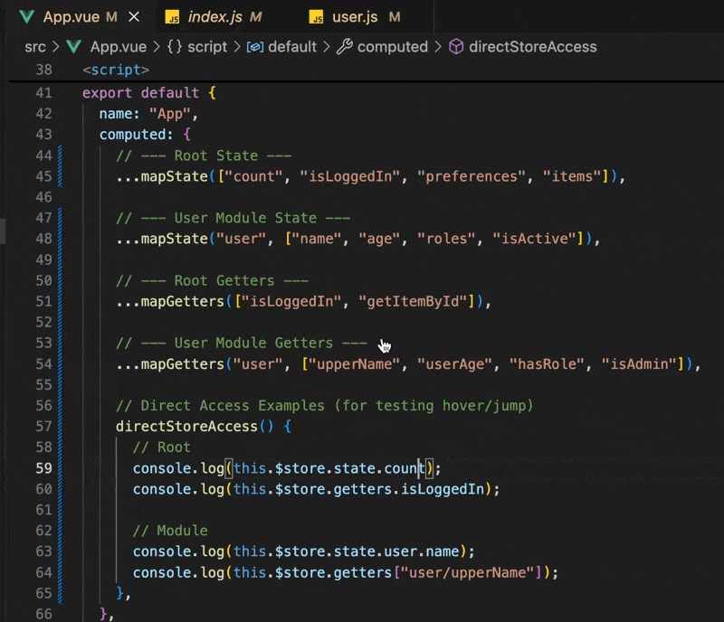
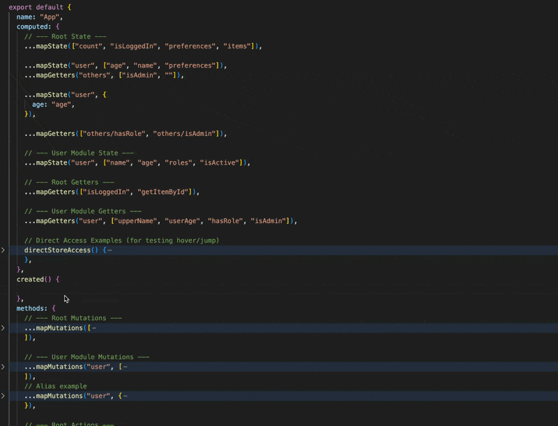
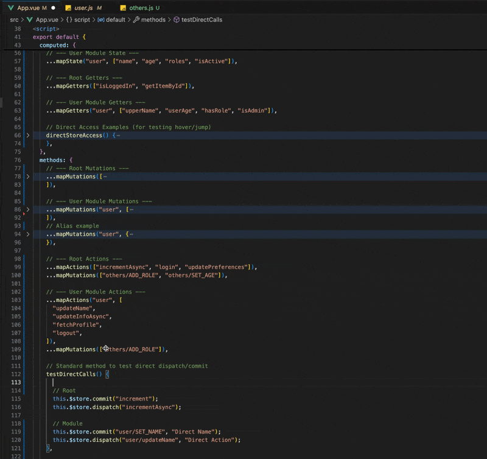
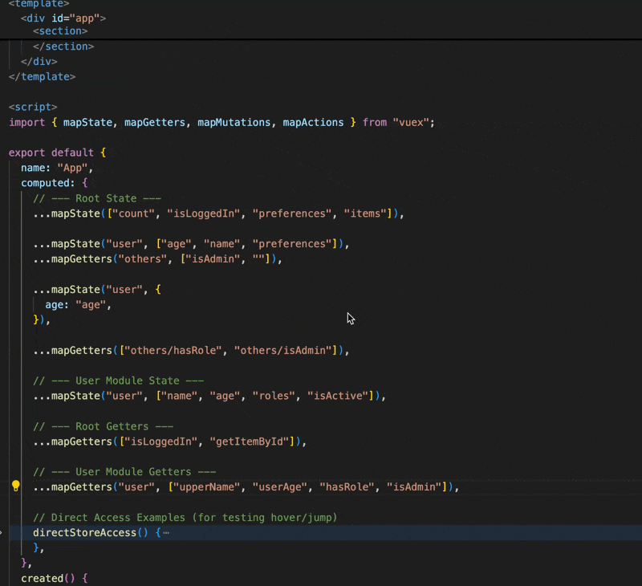
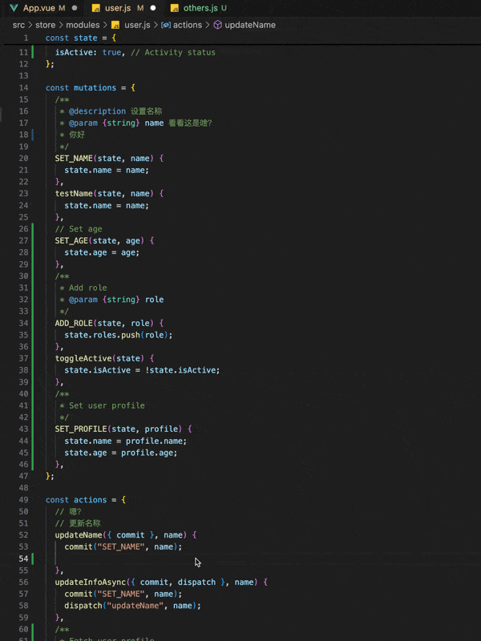

# Vuex Helper for Zed

[中文文档](./README.zh-CN.md)

Vuex Helper for Zed brings Vuex 2 navigation, completion, hover, and diagnostics support to Zed.

It helps you discover, complete, navigate, inspect, and validate Vuex State, Getters, Mutations, and Actions directly in your editor.

## Features

### 1. Go to Definition

Jump directly to the definition of Vuex store properties from your components.

#### Demo: Jump to Definition

#### 

- **Support**: `this.$store.state/getters/commit/dispatch`, imported store instance access (e.g. `import store from '@/store'`)
- **Map Helpers**: `mapState`, `mapGetters`, `mapMutations`, `mapActions`
- **Namespace**: Supports namespaced modules.
- **Optional Chaining**: Supports `?.` in store access chains.

### 2. Intelligent Code Completion

Intelligent suggestions for Vuex keys and mapped methods.

#### Demo: Context-Aware Completion

#### 

#### 

- **Context Aware**: Suggests actions for `dispatch`, mutations for `commit`, etc.
- **Namespace Filtering**: When using `mapState('user', [...])`, it correctly filters and shows only items from the `user` module.
- **Mapped Methods**: Type `this.` to see mapped methods (e.g. `this.increment` mapped from `...mapMutations(['increment'])`).
- **Bracket Notation**: Supports `this['namespace/method']` syntax for accessing mapped properties.
- **Map Helpers**: Supports array and object syntax (e.g. `...mapActions({ alias: 'name' })`).
- **Imported Store Completion**: Supports `store.state/getters/commit/dispatch` after direct store import.

### 3. Hover Information & Type Inference

View JSDoc documentation, details, and inferred types without leaving your code.

#### Demo: Hover Documentation

#### 

- **JSDoc Support**: Displays comments written in `/** ... */` format from your store definitions.
- **Type Inference**: Automatically infers and displays the type of State properties in hover tooltips (e.g. `(State) appName: string`).
- **Mapped Methods**: View documentation for mapped methods.
- **Details**: Shows the type and the file path of the definition.
- **Imported Store Hover**: Supports hover info for direct store import usage.

### 4. Store Internal Usage

Supports code completion, go to definition, and hover information within Vuex store files.

#### Demo: Store Internal Code Completion, Jump to Definition, Hover Information



- **Module Scope**: When writing actions in a module, suggestions for `commit` and `dispatch` are filtered to the current module context.
- **Action Context Object**: Supports `context.state`, `context.getters`, `context.rootState`, and `context.rootGetters` in store files.
- **Object-Style Handlers**: Supports Vuex object-style action handlers such as `actions: { someAction: { handler(ctx) {}, root: true } }`.

### 5. Diagnostics

Highlights invalid Vuex store references as warnings directly in Zed.

- **Map Helpers**: Validates string arguments in `mapState`, `mapGetters`, `mapMutations`, `mapActions`.
- **Commit / Dispatch**: Checks first argument of `commit()` and `dispatch()` calls.
- **Store Access**: Validates first-segment `$store.state/getters` dot access and bracket notation.
- **Store Internal**: Validates store-file `state.xxx` access plus `rootState` / `rootGetters` references.
- **Global Getter Conflicts**: Warns when root or non-namespaced modules register duplicate global getter names.
- **Comment Lines**: Skips common commented-out references on full comment lines.

## Supported Syntax

- **Helper Functions**:
  ```javascript
  ...mapState(['count'])
  ...mapState('user', ['name']) // Namespaced
  ...mapState({ alias: 'count' }) // Object aliasing
  ...mapState({ count: state => state.count }) // Arrow function
  ...mapState({ count(state) { return state.count } }) // Regular function
  ...mapActions({ add: 'increment' }) // Object aliasing
  ...mapActions(['add/increment'])
  ```

- **Store Methods**:
  ```javascript
  this.$store.commit('SET_NAME', value);
  this.$store.dispatch('user/updateName', value);
  import store from '@/store';
  store.commit('SET_NAME', value);
  store?.getters?.['others/hasNotifications'];
  commit('increment', null, { root: true });
  actions: {
    publishProfile: {
      handler(context) {
        return context.state.ready;
      },
      root: true
    }
  }
  ```

- **Component Methods**:
  ```javascript
  this.increment(); // Mapped via mapMutations
  this.appName; // Mapped via mapState
  ```

## Feature Coverage

| Feature                                     | Status | Notes                                              |
| ------------------------------------------- | ------ | -------------------------------------------------- |
| `mapState` — array syntax                   | Yes    | `...mapState(['count'])`                           |
| `mapState` — object string alias            | Yes    | `...mapState({ alias: 'count' })`                  |
| `mapState` — arrow function                 | Yes    | `...mapState({ c: state => state.count })`         |
| `mapState` — regular function               | Yes    | `...mapState({ c(state) { return state.count } })` |
| `mapState` — namespaced                     | Yes    | `...mapState('user', [...])`                       |
| `mapGetters` — array / object               | Yes    |                                                    |
| `mapMutations` — array / object             | Yes    |                                                    |
| `mapActions` — array / object               | Yes    |                                                    |
| `this.$store.state/getters/commit/dispatch` | Yes    | Dot and bracket notation                           |
| Imported store instance access              | Yes    | `import store from '@/store'`                      |
| Store access optional chaining              | Yes    | `this.$store?.getters?.['a/b']`                    |
| `createNamespacedHelpers`                   | Yes    |                                                    |
| Object-style commit                         | Yes    | `commit({ type: 'inc' })`                          |
| `state` as function                         | Yes    | `state: () => ({})`                                |
| Nested state                                | Yes    | Recursive parsing                                  |
| Computed property keys                      | Yes    | ``[SOME_MUTATION]`` ``(state) {}``                 |
| Dynamic module import/require               | Yes    | ES Module & CommonJS                               |
| Namespaced modules                          | Yes    | Including nested                                   |
| `this` alias completion                     | Yes    | `const _t = this; _t.`                             |
| `{ root: true }` namespace switch           | Yes    | commit/dispatch with root option                   |
| State chain intermediate jump               | Yes    | Click `user` in `state.user.name`                  |
| Vuex dependency detection                   | Yes    | Silent deactivation when workspace has no Vuex dependency |
| `rootState` / `rootGetters`                 | Yes    | Completion, definition, hover, and diagnostics     |
| `context.state` / `context.getters`         | Yes    | Store-file completion, definition, hover, and diagnostics |
| Object-style action handlers                | Yes    | `actions: { save: { handler(ctx) {}, root: true } }` |
| Inherited nested module namespace assets    | Yes    | Child assets inherit parent namespace when applicable |
| Duplicate global getter conflict diagnostics | Yes   | Warns on root and non-namespaced getter collisions |
| Diagnostics for invalid store references    | Yes    | Warning on non-existent state/getter/mutation/action |

## Requirements

- Zed editor.
- A Vue 2 project using Vuex 2.
- The project should contain a Vuex store entry that can be discovered from `src/main.{js,ts}` or `src/index.{js,ts}` via `new Vue({ store })`.

## Configuration

If your Vuex store entry cannot be discovered automatically, configure it in the target project's `.zed/settings.json`:

```json
{
  "lsp": {
    "vuex-helper": {
      "settings": {
        "storeEntry": "src/store/index.js"
      }
    }
  }
}
```

`storeEntry` supports workspace-relative paths and project aliases such as `@/store/index.js` when the alias is defined in `jsconfig.json` or `tsconfig.json`.

## Current Scope

This Zed extension currently focuses on:

- Go to Definition
- Code Completion
- Hover Information
- Diagnostics

## Not Included Yet

- Rename
- References
- Workspace Symbol
- Code Action
- Zed-specific configuration UI
